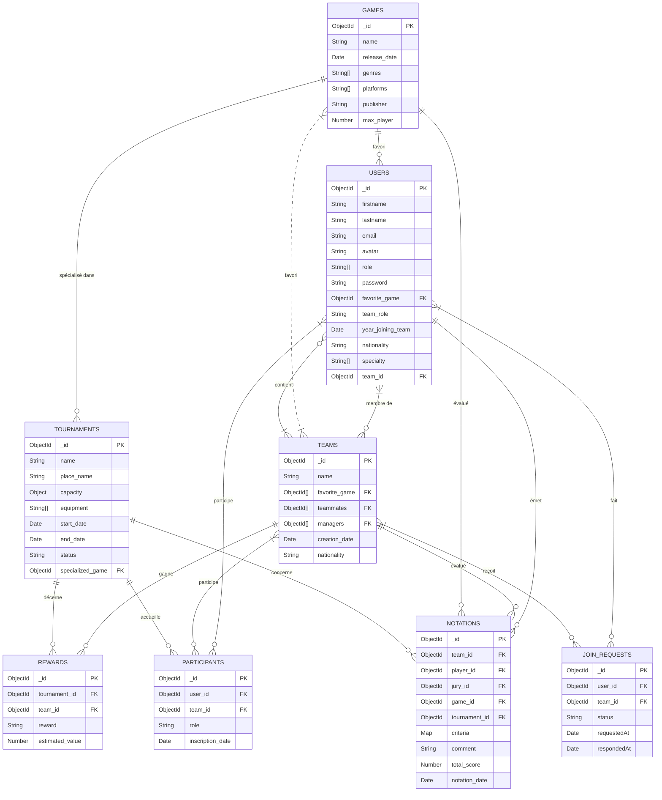

# MLD Merise - Base de données API Esport

## MLD de la méthode Merise en mermaid (ER)
https://mermaid.ai/open-source/syntax/entityRelationshipDiagram.html 

## Remarques
- Les relations `PARTICIPANTS` et `JOIN_REQUESTS` sont des entités d'association importantes pour modéliser les inscriptions et les demandes.
- `TEAMS.favorite_game`, `TEAMS.teammates` et `TEAMS.managers` sont des tableaux de références vers d'autres entités.
- L'entité `NOTATIONS` relie l'évaluation d'une équipe/joueur à un jury, une partie et un tournoi.
